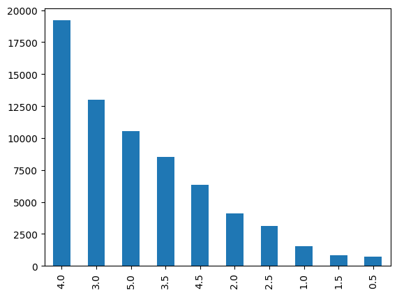
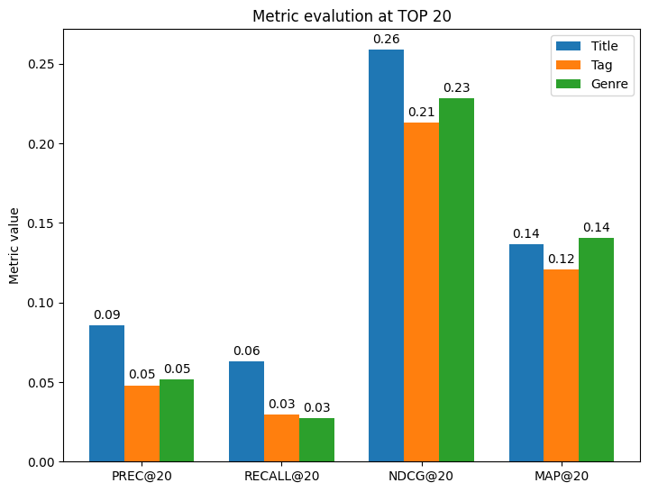

# Quality of content-based information in datasets used for RecSys

Exploratory project for *Introduction to RecSys and User Preferences* class meant to analyze individual differences between varying content-based information provided by selected datasets. For each dataset, there exists a limited set of information that can be exploited/used for recommendation purposes. Project tries to evaluate Content-based recommender systems using subsets of available information from individual datasets and compare key offline evaluation metrics between used subsets of information.

#### Selected Datasets:
- **MovieLens-100K** (also ML-Latest for feature extraction and analysis)
  - *CB Information*:
    - Genres
    - Tags
    - Release Years
- **Book Crossing Dataset**
  - Using pre-filtered version with only 3 event types
  - This dataset consists of:
    - 92,490 interactions from 3,431 users on 8,885 items.
    - History: 3,423 users and 8,878 items (78,372 accesses) 
    - Purchase: 824 users and 3,077 items (5,089 interactions)
    - Add to cart: 1,557 users and 4,447 items (9,029 interactions) 
    - Content: Implicit feedback by Event type (View, Add to cart, Purchase)

- **RetailRocket**
  - Using pre-filtered version
  - 272,679 interactions (explicit / implicit) from 2,946 users on 17,384 books.
  - Ratings: 1,295 users and 14,684 books (62,657 ratings applied)
  - Ratings are between 1 - 10.
  - *CB Information*: Simple demographic info for the users (age, gender, occupation, zip)

Out of all evaluations, the one with the most variable information and the one most analysed is the ML-100K. (More evaluations in respective dataset folders)

## Movielens 100k - Content-based RS Evaluation

For this evaluation precomputed Item-to-Item similarities were used. To generate required data, run "*movielens-cb.ipynb*" notebook.


```python
import numpy as np
import pandas as pd
from matplotlib import pyplot as plt
from pandas.errors import SettingWithCopyWarning
from sklearn.model_selection import train_test_split
import warnings
warnings.simplefilter(action='ignore', category=FutureWarning)
warnings.simplefilter(action='ignore', category=SettingWithCopyWarning)
```


```python
df = pd.read_csv("ml-latest-small/ratings.csv", sep=",")
df
```


<div>
<table border="1" class="dataframe">
  <thead>
    <tr style="text-align: right;">
      <th></th>
      <th>userId</th>
      <th>movieId</th>
      <th>rating</th>
      <th>timestamp</th>
    </tr>
  </thead>
  <tbody>
    <tr>
      <th>0</th>
      <td>1</td>
      <td>1</td>
      <td>4.0</td>
      <td>964982703</td>
    </tr>
    <tr>
      <th>1</th>
      <td>1</td>
      <td>3</td>
      <td>4.0</td>
      <td>964981247</td>
    </tr>
    <tr>
      <th>2</th>
      <td>1</td>
      <td>6</td>
      <td>4.0</td>
      <td>964982224</td>
    </tr>
    <tr>
      <th>3</th>
      <td>1</td>
      <td>47</td>
      <td>5.0</td>
      <td>964983815</td>
    </tr>
    <tr>
      <th>4</th>
      <td>1</td>
      <td>50</td>
      <td>5.0</td>
      <td>964982931</td>
    </tr>
    <tr>
      <th>...</th>
      <td>...</td>
      <td>...</td>
      <td>...</td>
      <td>...</td>
    </tr>
    <tr>
      <th>100831</th>
      <td>610</td>
      <td>166534</td>
      <td>4.0</td>
      <td>1493848402</td>
    </tr>
    <tr>
      <th>100832</th>
      <td>610</td>
      <td>168248</td>
      <td>5.0</td>
      <td>1493850091</td>
    </tr>
    <tr>
      <th>100833</th>
      <td>610</td>
      <td>168250</td>
      <td>5.0</td>
      <td>1494273047</td>
    </tr>
    <tr>
      <th>100834</th>
      <td>610</td>
      <td>168252</td>
      <td>5.0</td>
      <td>1493846352</td>
    </tr>
    <tr>
      <th>100835</th>
      <td>610</td>
      <td>170875</td>
      <td>3.0</td>
      <td>1493846415</td>
    </tr>
  </tbody>
</table>
<p>100836 rows × 4 columns</p>
</div>


```python
moviesDF = pd.read_csv("ml-latest-small/movies.csv", sep=",")
moviesDF.movieId = moviesDF.movieId.astype(int)
moviesDF.set_index("movieId", inplace=True)

# Extract years
moviesDF["year"] = moviesDF.title.str.extract(r'\(([0-9]+)\)')
moviesDF["year"] = moviesDF.year.astype("float")

# Clean title
moviesDF["title"] = moviesDF.title.str.replace(r'\(([0-9]+)\)$', "").str.strip()

# Clean genres
moviesDF["genres"] = moviesDF.genres.str.lower()

moviesDF
```


<div>
<table border="1" class="dataframe">
  <thead>
    <tr style="text-align: right;">
      <th></th>
      <th>title</th>
      <th>genres</th>
      <th>year</th>
    </tr>
    <tr>
      <th>movieId</th>
      <th></th>
      <th></th>
      <th></th>
    </tr>
  </thead>
  <tbody>
    <tr>
      <th>1</th>
      <td>Toy Story</td>
      <td>adventure|animation|children|comedy|fantasy</td>
      <td>1995.0</td>
    </tr>
    <tr>
      <th>2</th>
      <td>Jumanji</td>
      <td>adventure|children|fantasy</td>
      <td>1995.0</td>
    </tr>
    <tr>
      <th>3</th>
      <td>Grumpier Old Men</td>
      <td>comedy|romance</td>
      <td>1995.0</td>
    </tr>
    <tr>
      <th>4</th>
      <td>Waiting to Exhale</td>
      <td>comedy|drama|romance</td>
      <td>1995.0</td>
    </tr>
    <tr>
      <th>5</th>
      <td>Father of the Bride Part II</td>
      <td>comedy</td>
      <td>1995.0</td>
    </tr>
    <tr>
      <th>...</th>
      <td>...</td>
      <td>...</td>
      <td>...</td>
    </tr>
    <tr>
      <th>193581</th>
      <td>Black Butler: Book of the Atlantic</td>
      <td>action|animation|comedy|fantasy</td>
      <td>2017.0</td>
    </tr>
    <tr>
      <th>193583</th>
      <td>No Game No Life: Zero</td>
      <td>animation|comedy|fantasy</td>
      <td>2017.0</td>
    </tr>
    <tr>
      <th>193585</th>
      <td>Flint</td>
      <td>drama</td>
      <td>2017.0</td>
    </tr>
    <tr>
      <th>193587</th>
      <td>Bungo Stray Dogs: Dead Apple</td>
      <td>action|animation</td>
      <td>2018.0</td>
    </tr>
    <tr>
      <th>193609</th>
      <td>Andrew Dice Clay: Dice Rules</td>
      <td>comedy</td>
      <td>1991.0</td>
    </tr>
  </tbody>
</table>
<p>9742 rows × 3 columns</p>
</div>


```python
df["title"] = moviesDF.title.loc[df.movieId].values
df.drop(columns=["timestamp"], inplace=True)
```

Let's use ratings by people, that have more than 20 ratings total for evaluation.


```python
ratingCounts = df.groupby("movieId")["userId"].count()
valid_items = ratingCounts.loc[ratingCounts >= 20].index.values
df = df.loc[df.movieId.isin(valid_items)]
df
```


<div>
<table border="1" class="dataframe">
  <thead>
    <tr style="text-align: right;">
      <th></th>
      <th>userId</th>
      <th>movieId</th>
      <th>rating</th>
      <th>title</th>
    </tr>
  </thead>
  <tbody>
    <tr>
      <th>0</th>
      <td>1</td>
      <td>1</td>
      <td>4.0</td>
      <td>Toy Story</td>
    </tr>
    <tr>
      <th>1</th>
      <td>1</td>
      <td>3</td>
      <td>4.0</td>
      <td>Grumpier Old Men</td>
    </tr>
    <tr>
      <th>2</th>
      <td>1</td>
      <td>6</td>
      <td>4.0</td>
      <td>Heat</td>
    </tr>
    <tr>
      <th>3</th>
      <td>1</td>
      <td>47</td>
      <td>5.0</td>
      <td>Seven (a.k.a. Se7en)</td>
    </tr>
    <tr>
      <th>4</th>
      <td>1</td>
      <td>50</td>
      <td>5.0</td>
      <td>Usual Suspects, The</td>
    </tr>
    <tr>
      <th>...</th>
      <td>...</td>
      <td>...</td>
      <td>...</td>
      <td>...</td>
    </tr>
    <tr>
      <th>100803</th>
      <td>610</td>
      <td>148626</td>
      <td>4.0</td>
      <td>Big Short, The</td>
    </tr>
    <tr>
      <th>100808</th>
      <td>610</td>
      <td>152081</td>
      <td>4.0</td>
      <td>Zootopia</td>
    </tr>
    <tr>
      <th>100829</th>
      <td>610</td>
      <td>164179</td>
      <td>5.0</td>
      <td>Arrival</td>
    </tr>
    <tr>
      <th>100830</th>
      <td>610</td>
      <td>166528</td>
      <td>4.0</td>
      <td>Rogue One: A Star Wars Story</td>
    </tr>
    <tr>
      <th>100834</th>
      <td>610</td>
      <td>168252</td>
      <td>5.0</td>
      <td>Logan</td>
    </tr>
  </tbody>
</table>
<p>67898 rows × 4 columns</p>
</div>


```python
df.rating.value_counts().plot(kind = "bar")
```


    <AxesSubplot: >


    

    


### Mapping users and items


```python
map_users = {user: u_id for u_id, user in enumerate(df.userId.unique())}
map_items = {item: i_id for i_id, item in enumerate(df.movieId.unique())}

df["movieId"] = df["movieId"].map(map_items)
df["userId"] = df["userId"].map(map_users)
```


```python
df.head()
```


<div>
<table border="1" class="dataframe">
  <thead>
    <tr style="text-align: right;">
      <th></th>
      <th>userId</th>
      <th>movieId</th>
      <th>rating</th>
      <th>title</th>
    </tr>
  </thead>
  <tbody>
    <tr>
      <th>0</th>
      <td>0</td>
      <td>0</td>
      <td>4.0</td>
      <td>Toy Story</td>
    </tr>
    <tr>
      <th>1</th>
      <td>0</td>
      <td>1</td>
      <td>4.0</td>
      <td>Grumpier Old Men</td>
    </tr>
    <tr>
      <th>2</th>
      <td>0</td>
      <td>2</td>
      <td>4.0</td>
      <td>Heat</td>
    </tr>
    <tr>
      <th>3</th>
      <td>0</td>
      <td>3</td>
      <td>5.0</td>
      <td>Seven (a.k.a. Se7en)</td>
    </tr>
    <tr>
      <th>4</th>
      <td>0</td>
      <td>4</td>
      <td>5.0</td>
      <td>Usual Suspects, The</td>
    </tr>
  </tbody>
</table>
</div>


### Creating inverse mappings for future recommendations


```python
movieId_title = {}
for idx, row in df.iterrows():
    movieId_title[row["movieId"]] = row["title"]
    
np.save("mappings/map_title.npy", movieId_title)
    
movieId_genres = pd.Series(moviesDF.genres, index = moviesDF.index)
    
np.save("mappings/map_genres.npy", movieId_genres)

movieId_tags = pd.Series(np.load("mappings/map_tags.npy", allow_pickle=True))
```

### Split User-Item Dataset 


```python
# Using randomized (0.33 * df.size) for testing and the rest (0.67 * df.size) for training
train, test = train_test_split(df, test_size = 0.33, random_state = 56)
train.to_csv("train.dat", index=False, header=False, sep="\t", encoding="CP1250", errors="ignore")
test.to_csv("test.dat", index=False, header=False, sep="\t", encoding="CP1250", errors="ignore")
```

### Content-based similarities preprocessing


```python
unique_movie_ids = pd.concat([train, test]).movieId.unique()
unique_movie_ids.shape
```


    (1297,)


```python
# Preprocessing precomputed metadata_files (similarity files) to only include movies rated by some people (which we are observing)
def preprocess_metadata(metadata_file):
    metadata = pd.read_csv(metadata_file, sep="\t", encoding="CP1250", header=None, names=["item1", "item2", "rel"])
    filtered = metadata.loc[metadata["item1"].isin(unique_movie_ids) & metadata["item2"].isin(unique_movie_ids)]
    filtered.to_csv(f"processed/{metadata_file}", index=False, header=False, sep="\t", encoding="CP1250", errors="ignore")
```


```python
preprocess_metadata("title_sim.dat")
preprocess_metadata("tag_sim.dat")
preprocess_metadata("genre_sim.dat")
preprocess_metadata("title_tag_sim.dat")
preprocess_metadata("title_genre_sim.dat")
```

### Train and evaluate

Using *caserec* RS library we evaluate CB RecSys using real ratings made by users in testing data. If the item recommended to the user is seen by the user in testing data, we think of it as relevant.


```python
from caserec.recommenders.item_recommendation.content_based import ContentBased

# Top-N recommendations
RANK_LENGTH = 50
# Optional metrics used for evaluation: ["PREC", "RECALL", "NDCG", "MAP"]
METRICS = ["PREC", "RECALL", "NDCG", "MAP"]
# For which ranks we evaluate metrics
RANK_EVAL = [10, 20, 50]
```

Title similarity


```python
title_model = ContentBased("train.dat", "test.dat", similarity_file="processed/title_sim.dat", 
                             output_file="output/rank_title.dat", as_binary=False, rank_length=RANK_LENGTH)
title_model.compute(as_table=True, table_sep="\t", metrics=METRICS, n_ranks=RANK_EVAL)
```

    [Case Recommender: Item Recommendation > Content Based Algorithm]
    
    train data:: 610 users and 1297 items (45491 interactions) | sparsity:: 94.25%
    test data:: 610 users and 1297 items (22407 interactions) | sparsity:: 97.17%
    
    training_time:: 0.007982 sec
    prediction_time:: 22.567967 sec
    
    
    PREC@10	PREC@20	PREC@50	RECALL@10	RECALL@20	RECALL@50	NDCG@10	NDCG@20	NDCG@50	MAP@10	MAP@20	MAP@50	
    0.06623	0.085656	0.081607	0.023463	0.063036	0.128316	0.216975	0.258815	0.291939	0.132644	0.136731	0.133862	
    

Tags similarity


```python
tag_model = ContentBased("train.dat", "test.dat", similarity_file="processed/tag_sim.dat", 
                             output_file="output/rank_tag.dat", as_binary=False, rank_length=RANK_LENGTH)
tag_model.compute(as_table=True, table_sep="\t", metrics=METRICS, n_ranks=RANK_EVAL)
```

    [Case Recommender: Item Recommendation > Content Based Algorithm]
    
    train data:: 610 users and 1297 items (45491 interactions) | sparsity:: 94.25%
    test data:: 610 users and 1297 items (22407 interactions) | sparsity:: 97.17%
    
    training_time:: 0.010037 sec
    prediction_time:: 22.910093 sec
    
    
    PREC@10	PREC@20	PREC@50	RECALL@10	RECALL@20	RECALL@50	NDCG@10	NDCG@20	NDCG@50	MAP@10	MAP@20	MAP@50	
    0.047869	0.047951	0.051934	0.013491	0.029481	0.094047	0.174812	0.213229	0.248201	0.117574	0.120592	0.100002	
    

Genre similarity


```python
genre_model = ContentBased("train.dat", "test.dat", similarity_file="processed/genre_sim.dat", 
                             output_file="output/rank_genre.dat", as_binary=False, rank_length=RANK_LENGTH)
genre_model.compute(as_table=True, table_sep="\t", metrics=METRICS, n_ranks=RANK_EVAL)
```

    [Case Recommender: Item Recommendation > Content Based Algorithm]
    
    train data:: 610 users and 1297 items (45491 interactions) | sparsity:: 94.25%
    test data:: 610 users and 1297 items (22407 interactions) | sparsity:: 97.17%
    
    training_time:: 1.218894 sec
    prediction_time:: 23.614394 sec
    
    
    PREC@10	PREC@20	PREC@50	RECALL@10	RECALL@20	RECALL@50	NDCG@10	NDCG@20	NDCG@50	MAP@10	MAP@20	MAP@50	
    0.055738	0.051885	0.041213	0.015075	0.027308	0.05433	0.216125	0.228107	0.245012	0.149846	0.140758	0.1212	
    

Combination of Title and Tag similarities


```python
title_tag_model = ContentBased("train.dat", "test.dat", similarity_file="processed/title_tag_sim.dat", 
                             output_file="output/rank_title_tag.dat", as_binary=False, rank_length=RANK_LENGTH)
title_tag_model.compute(as_table=True, table_sep="\t", metrics=METRICS, n_ranks=RANK_EVAL)
```

    [Case Recommender: Item Recommendation > Content Based Algorithm]
    
    train data:: 610 users and 1297 items (45491 interactions) | sparsity:: 94.25%
    test data:: 610 users and 1297 items (22407 interactions) | sparsity:: 97.17%
    
    training_time:: 0.010617 sec
    prediction_time:: 22.795777 sec
    
    
    PREC@10	PREC@20	PREC@50	RECALL@10	RECALL@20	RECALL@50	NDCG@10	NDCG@20	NDCG@50	MAP@10	MAP@20	MAP@50	
    0.047541	0.047295	0.050328	0.013271	0.028799	0.09214	0.174127	0.211382	0.246048	0.117886	0.11984	0.099411	
    

Combination of Title and Genre similarities


```python
title_genre_model = ContentBased("train.dat", "test.dat", similarity_file="processed/title_genre_sim.dat", 
                             output_file="output/rank_title_genre.dat", as_binary=False, rank_length=RANK_LENGTH)
title_genre_model.compute(as_table=True, table_sep="\t", metrics=METRICS, n_ranks=RANK_EVAL)
```

    [Case Recommender: Item Recommendation > Content Based Algorithm]
    
    train data:: 610 users and 1297 items (45491 interactions) | sparsity:: 94.25%
    test data:: 610 users and 1297 items (22407 interactions) | sparsity:: 97.17%
    
    training_time:: 1.182623 sec
    prediction_time:: 23.658360 sec
    
    
    PREC@10	PREC@20	PREC@50	RECALL@10	RECALL@20	RECALL@50	NDCG@10	NDCG@20	NDCG@50	MAP@10	MAP@20	MAP@50	
    0.055738	0.051885	0.04118	0.015075	0.027308	0.054002	0.216125	0.228098	0.244707	0.149027	0.139932	0.12034	
    

Some example of recommendation using title+genre variant:


```python
ranking = pd.read_csv('output/rank_title_genre.dat', sep='\t', names=["userId", "movieId", "rating"])
ranking["title"] = ranking.movieId.map(movieId_title)
ranking["tags"] = ranking.movieId.map(movieId_tags)
ranking["genres"] = ranking.movieId.map(movieId_genres)
ranking.sort_values(by="rating", ascending=False).head(5)
```


<div>
<table border="1" class="dataframe">
  <thead>
    <tr style="text-align: right;">
      <th></th>
      <th>userId</th>
      <th>movieId</th>
      <th>rating</th>
      <th>title</th>
      <th>tags</th>
      <th>genres</th>
    </tr>
  </thead>
  <tbody>
    <tr>
      <th>24900</th>
      <td>498</td>
      <td>917</td>
      <td>0.585525</td>
      <td>Entrapment</td>
      <td></td>
      <td>children|drama</td>
    </tr>
    <tr>
      <th>9696</th>
      <td>193</td>
      <td>412</td>
      <td>0.582343</td>
      <td>Multiplicity</td>
      <td>assassination</td>
      <td>drama</td>
    </tr>
    <tr>
      <th>9684</th>
      <td>193</td>
      <td>334</td>
      <td>0.582343</td>
      <td>Sense and Sensibility</td>
      <td>bus</td>
      <td>drama</td>
    </tr>
    <tr>
      <th>9670</th>
      <td>193</td>
      <td>254</td>
      <td>0.582343</td>
      <td>Strictly Ballroom</td>
      <td>assassin jean reno hit men action assassin ass...</td>
      <td>drama</td>
    </tr>
    <tr>
      <th>9671</th>
      <td>193</td>
      <td>263</td>
      <td>0.582343</td>
      <td>Mars Attacks!</td>
      <td></td>
      <td>drama</td>
    </tr>
  </tbody>
</table>
</div>


```python
# Top-10 recommendation for User 1
ranking.loc[ranking.userId == 1].head(10)
```


<div>
<table border="1" class="dataframe">
  <thead>
    <tr style="text-align: right;">
      <th></th>
      <th>userId</th>
      <th>movieId</th>
      <th>rating</th>
      <th>title</th>
      <th>tags</th>
      <th>genres</th>
    </tr>
  </thead>
  <tbody>
    <tr>
      <th>50</th>
      <td>1</td>
      <td>4</td>
      <td>0.399869</td>
      <td>Usual Suspects, The</td>
      <td>pregnancy remake</td>
      <td>comedy|drama|romance</td>
    </tr>
    <tr>
      <th>51</th>
      <td>1</td>
      <td>11</td>
      <td>0.399869</td>
      <td>Clerks</td>
      <td></td>
      <td>comedy|drama|romance</td>
    </tr>
    <tr>
      <th>52</th>
      <td>1</td>
      <td>52</td>
      <td>0.399869</td>
      <td>Reservoir Dogs</td>
      <td>writing</td>
      <td>comedy|drama|romance</td>
    </tr>
    <tr>
      <th>53</th>
      <td>1</td>
      <td>58</td>
      <td>0.399869</td>
      <td>Star Wars: Episode V - The Empire Strikes Back</td>
      <td></td>
      <td>comedy|drama|romance</td>
    </tr>
    <tr>
      <th>54</th>
      <td>1</td>
      <td>94</td>
      <td>0.399869</td>
      <td>Wild Things</td>
      <td></td>
      <td>comedy|drama|romance</td>
    </tr>
    <tr>
      <th>55</th>
      <td>1</td>
      <td>195</td>
      <td>0.399869</td>
      <td>Girl with the Dragon Tattoo, The</td>
      <td></td>
      <td>comedy|drama|romance</td>
    </tr>
    <tr>
      <th>56</th>
      <td>1</td>
      <td>224</td>
      <td>0.399869</td>
      <td>Heavenly Creatures</td>
      <td>classic space action action sci fi epic great ...</td>
      <td>comedy|drama|romance</td>
    </tr>
    <tr>
      <th>57</th>
      <td>1</td>
      <td>232</td>
      <td>0.399869</td>
      <td>In the Name of the Father</td>
      <td></td>
      <td>comedy|drama|romance</td>
    </tr>
    <tr>
      <th>58</th>
      <td>1</td>
      <td>281</td>
      <td>0.399869</td>
      <td>Waking Ned Devine (a.k.a. Waking Ned)</td>
      <td></td>
      <td>comedy|drama|romance</td>
    </tr>
    <tr>
      <th>59</th>
      <td>1</td>
      <td>351</td>
      <td>0.399869</td>
      <td>Crimson Tide</td>
      <td></td>
      <td>comedy|drama|romance</td>
    </tr>
  </tbody>
</table>
</div>


## Summary

Based on the above 4 variants of using title, tag, genre, title+tag and title+genre for Content-based recommendation, these are the results:


```python
# x = ["PREC@10","PREC@20","PREC@50","RECALL@10","RECALL@20","RECALL@50","NDCG@10","NDCG@20","NDCG@50","MAP@10","MAP@20","MAP@50"]
labels = ["PREC@20","RECALL@20","NDCG@20","MAP@20"]
y1 = [0.085656,0.063036,0.258815,0.136731]
y2 = [0.047951,0.029481,0.213229,0.120592]
y3 = [0.051885,0.027308,0.228107,0.140758]

x = np.arange(len(labels))
width = 0.25

fig, ax = plt.subplots()
ax = fig.add_axes([0,0,1,1])
rects1 = ax.bar(x - 0.25, y1, width, label="Title")
rects2 = ax.bar(x, y2, width, label="Tag")
rects3 = ax.bar(x + 0.25, y3, width, label="Genre")

ax.set_ylabel("Metric value")
ax.set_title("Metric evalution at TOP 20")
ax.set_xticks(x, labels)
ax.legend()

ax.bar_label(rects1, padding=3, fmt='%.2f')
ax.bar_label(rects2, padding=3, fmt='%.2f')
ax.bar_label(rects3, padding=3, fmt='%.2f')

plt.show()
```


    

    


The Title-based similarities are the best-performing, followed by Genre and then Tags.

The Tags in the ML 100k dataset are extremely sparsed, so for better evaluation the ML 27M dataset could be used.
